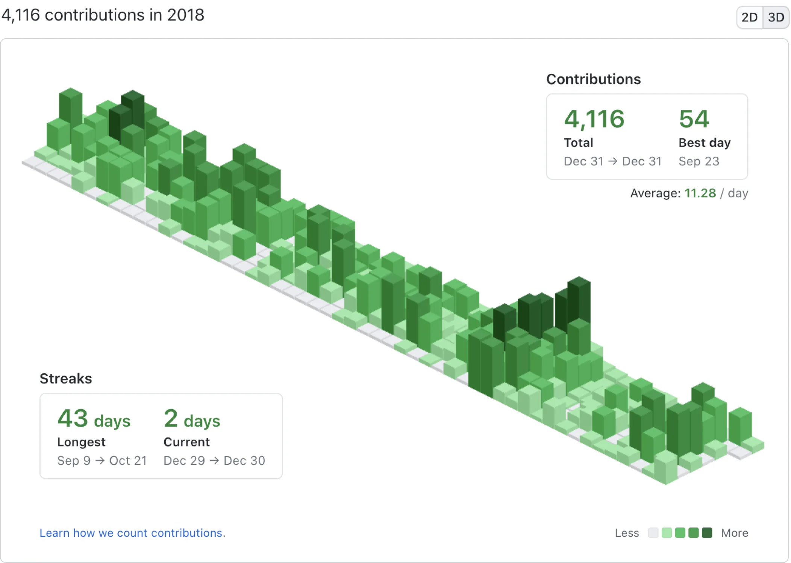
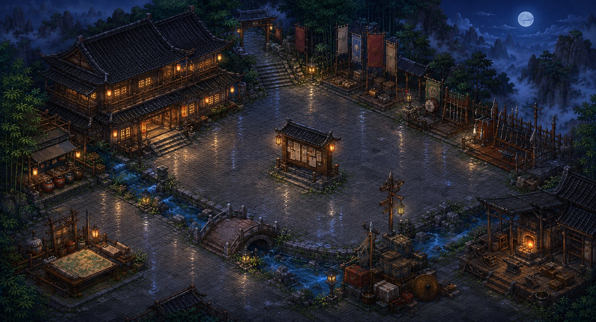
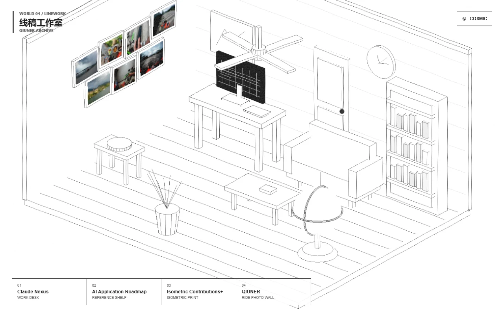
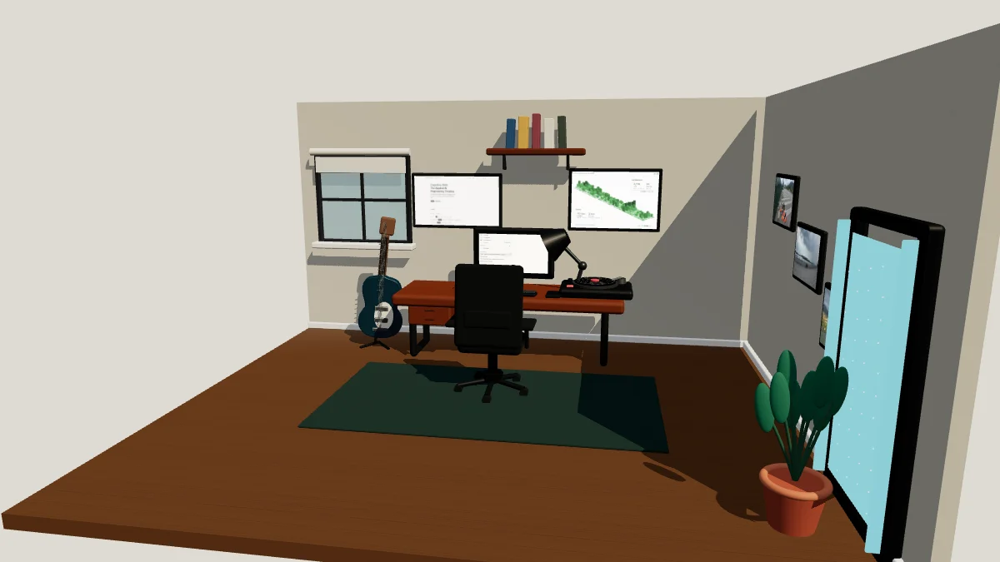

<div align="center">

# Qiuner.github.io

### 同一份个人经历，五个可交互世界

一个使用 Astro 与 Three.js 构建的沉浸式个人作品集。项目、经历与想法保持同一份事实来源，
分别被诠释为宇宙旅程、可航行群岛、鲜活的江湖客栈、线稿房间和精细工作室。

[](https://qiuner.github.io/)
[](https://github.com/Qiuner/Qiuner.github.io/actions/workflows/deploy.yml)
[](https://astro.build/)
[](https://threejs.org/)
[](https://www.typescriptlang.org/)

[进入作品集](https://qiuner.github.io/) · [English](README.md) · [架构文档](docs/ARCHITECTURE.zh-CN.md)

</div>

---

## 世界预览

<table>
  <tr>
    <td align="center" width="33%"><a href="https://qiuner.github.io/?world=cosmic"><br /><strong>宇宙世界</strong></a></td>
    <td align="center" width="33%"><a href="https://qiuner.github.io/?world=archipelago"><br /><strong>群岛世界</strong></a></td>
    <td align="center" width="33%"><a href="https://qiuner.github.io/?world=jianghu"><br /><strong>江湖世界</strong></a></td>
  </tr>
  <tr>
    <td align="center"><a href="https://qiuner.github.io/?world=linework"><br /><strong>线稿世界</strong></a></td>
    <td align="center"><a href="https://qiuner.github.io/?world=studio"><br /><strong>工作室世界</strong></a></td>
  </tr>
</table>

## 核心体验

### 五种视觉诠释

每个 World 都有独立的美术方向、相机语言、交互方式和 Portfolio Binding。
个人资料内容不会为了某个场景被复制或改写。

### Portal Journey

世界中的交互地标连接不同 World。Runtime 会先准备目标世界，确认其能够渲染后才交换所有权；
如果加载失败或旅程被取消，则完整回到来源世界。

### 单一 Content Kernel

项目、奖项、能力、时间线、链接和媒体都来自同一个语义事实源。
各 World 通过稳定的 Portfolio ID 引用内容，不依赖页面顺序或场景坐标。

### 自适应 3D Runtime

共享 Runtime 统一拥有 WebGL renderer、帧调度、输入路由、Quality Budget、
World Session 和资源清理。像素比、特效密度、阴影、更新频率与转场模式会根据设备预算调整。

### 静态优先降级

Astro 会在 WebGL 启动前输出完整可读的作品集。即使 JavaScript、WebGL 或某个 3D World
加载失败，核心内容仍然可以访问。

---

## 本地开发

```powershell
git clone https://github.com/Qiuner/Qiuner.github.io.git
cd Qiuner.github.io
npm install
npm run dev
```

访问 Astro 输出的本地地址，通常是 `http://localhost:4321`。

```powershell
# 类型与 Astro 诊断
npm run check

# 测试
npm test

# 生产构建与本地预览
npm run build
npm run preview
```

## 技术栈

- **站点与静态输出：** Astro 7
- **3D Runtime：** Three.js `WebGLRenderer`
- **语言：** TypeScript 6
- **World UI：** Vue 3 与 DOM overlay
- **测试：** Vitest + jsdom
- **托管：** GitHub Pages + GitHub Actions

## 仓库结构

- `src/content/portfolio.ts`：个人资料的唯一事实来源
- `src/runtime/`：renderer、帧调度、生命周期、Portal Journey 与资源所有权
- `src/worlds/`：可延迟加载的 World Module 与视觉映射
- `src/pages/index.astro`：静态 Portfolio 宿主与 Runtime 挂载点
- `public/`：本地托管的 World 和个人资料媒体
- `CONTEXT.zh-CN.md`：领域语言与架构不变量
- `docs/ARCHITECTURE.zh-CN.md`：已实现架构和演进计划
- `docs/adr/`：已接受的架构决策

## 架构

项目把个人资料事实与视觉呈现分开：

```text
Content Kernel → World Binding → World Module
                         ↓
Astro Host ← Shared Runtime → Portal Journey
```

Content Kernel 是唯一事实源，World Module 是可以独立加载的视觉诠释，Runtime 则独占
renderer、浏览器帧循环、输入路由、质量策略与 World Session 生命周期。

完整模型见[架构文档](docs/ARCHITECTURE.zh-CN.md)与[领域上下文](CONTEXT.zh-CN.md)。

## 部署

推送到 `main` 后，[部署工作流](.github/workflows/deploy.yml)会构建项目并发布到 GitHub Pages。
所有生产媒体与 Three.js 依赖均由本仓库持有，运行时不依赖 CDN。
