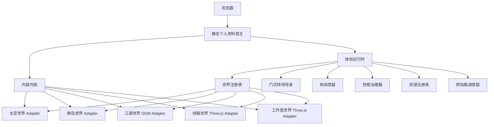
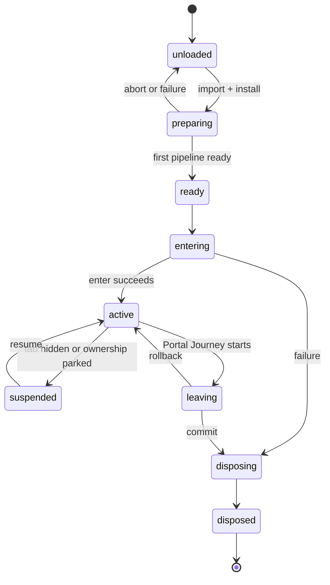
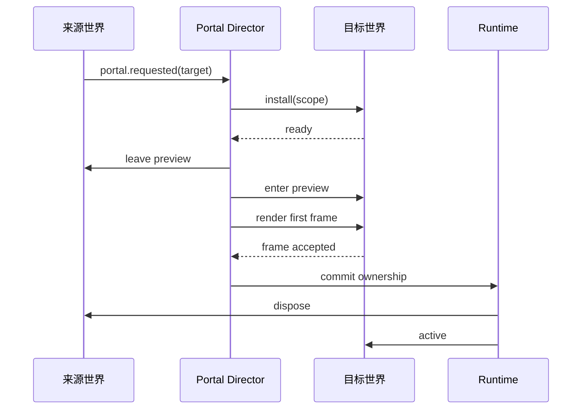

# 多世界个人作品集架构

[English](ARCHITECTURE.md)

状态：Content Kernel、Runtime 与五个原生 World Module 已接入；Archipelago 所有权迁移已完成
日期：2026-08-13

## 1. 目标

构建一个静态优先的个人网站：它能承载许多画风截然不同的交互世界，同时保留一份个人资料、一套部署方式、一个运行时，并在低性能设备上保持可预测的性能。

这套架构必须让新增第四个、甚至第七个世界都成为常规工作。新世界应实现一个狭窄的接口，提供映射和资源，而不修改已有世界。

## 2. 非目标

第一阶段架构不会：

- 创建公开插件 SDK；
- 在首次访问时加载所有世界；
- 引入 CMS 或服务器数据库；
- 强制依赖 WebGPU；
- 将渲染移入 `OffscreenCanvas`；
- 创建通用游戏引擎；
- 在接入前重写 Archipelago UI；
- 强迫每个世界共享一种视觉语言。

这些都是刻意的省略。Cosmic、Archipelago、Jianghu、Linework 与 Studio 五个真实 Adapter
已经证明 World Module seam 的必要性；新的抽象仍必须由至少两个现实实现
共同需要，不能只因为未来可能用到就加入。

## 3. 系统形态



Content Kernel 和 Runtime 是两个深模块：

- Content Kernel 在一个语义接口后隐藏校验、查询、关系和静态投影。
- Runtime 在一个接口后隐藏生命周期顺序、取消、帧所有权、资源清理、质量变更和转场恢复。

## 4. 技术基线

| 关注点 | 选择 | 原因 |
| --- | --- | --- |
| 静态宿主 | Astro 静态输出 | 3D 体验启动前，个人资料已作为 HTML 存在 |
| 构建 | Vite | TypeScript、代码分块、哈希资源和 GitHub Pages 构建 |
| 语言 | TypeScript | 为内容、世界、资源和转场提供稳定契约 |
| 3D 基线 | Three.js `WebGLRenderer` | 兼容 Cosmic、Archipelago 及自定义 GLSL/后处理 |
| Archipelago World 表现层 | 原生 Three.js World Module + Vue HUD | 使用 Runtime 共享 renderer、帧调度和 Resource Scope |
| Jianghu World 表现层 | DOM Adapter | 主要画面由 DOM 驱动，但安装、帧更新和销毁仍服从 Runtime |
| Linework World 表现层 | Three.js 边线 + 轻量后期 | 用程序化房间、Portfolio Binding 与共享 renderer 呈现线稿工作室 |
| Studio World 表现层 | Three.js 程序化室内场景 + DOM HUD | 用共享 renderer、彩色 Portfolio 贴图和可交互陈设呈现个人工作室 |
| 部署 | GitHub Actions + GitHub Pages | 账户名仓库中的纯静态托管 |

Astro 是宿主，不是视觉引擎。Vue 是当前 Archipelago World 的局部 HUD 技术，
Jianghu 使用 DOM 场景，Linework 与 Studio 使用不同视觉方向的程序化 Three.js 几何；
未来其他 World 也可以使用自己的局部 UI runtime，例如 React。这些 runtime
都应只是 World 内部 Adapter，不拥有整站导航、共享 renderer、浏览器帧循环、
Portal Journey 或跨世界状态。

## 5. 仓库形态

```text
src/
  content/
    portfolio.ts
    types.ts

  pages/
    index.astro
    3d-assets.astro

  runtime/
    experience-runtime.ts
    frame-scheduler.ts
    portal-director.ts
    quality-budget.ts
    resource-scope.ts
    renderer-host.ts
    world-session.ts

  worlds/
    worlds.config.ts
    registry.ts
    portals.config.ts
    cosmic/
      index.ts
      manifest.ts
      binding.ts
      world.ts
    archipelago/
      index.ts
      manifest.ts
      binding.ts
      world.ts
      ui/
      scene/
    jianghu/
      index.ts
      manifest.ts
      world.ts
      jianghu-scene.ts
    linework/
      index.ts
      manifest.ts
      binding.ts
      world.ts
      scene/
      ui/

tests/
  runtime/
  contracts/
  archipelago/
```

目录表达的是所有权，而不是随意的技术分类。世界特有知识应留在所属 World
内部；Archipelago 的场景、HUD、状态与 Binding 现在都由
`src/worlds/archipelago/` 唯一拥有。

## 6. Content Kernel

内容以 TypeScript 常量编写，并在构建期校验。

```ts
export const portfolio = {
  person: {
    id: "qiuner",
    name: "Qiuner",
    location: "Fuzhou, CN",
    summary: "...",
  },
  projects: [
    {
      id: "claude-nexus",
      title: "Claude Nexus",
      summary: "...",
      links: {
        product: "...",
        source: "...",
      },
      media: ["claude-nexus-cover"],
      metrics: [
        { label: "stars", value: 511, capturedAt: "2026-08-01" },
      ],
    },
  ],
  awards: [],
  timeline: [],
  capabilities: [],
} as const satisfies Portfolio;
```

规则：

- ID 永久有效且对人类可读。
- 展示顺序是显式数据，绝不从文件顺序推断。
- 时效性指标必须记录采集日期。
- 媒体条目只包含语义角色和变体，不包含相对布局。
- 外部链接在构建期校验。
- World Binding 只能引用已声明的 ID。

静态宿主与每个世界读取同一份经过校验的快照。

## 7. World Module 接口

最终选定的设计包含两层：

- 世界作者只接收一个安装入口和显式的宿主能力。
- Runtime 将这些注册内容转换为内部的、类型明确的生命周期状态机。

这让外部接口保持深度，同时不会把生命周期顺序降格为无类型事件协议。

```ts
export interface WorldModule {
  readonly manifest: WorldManifest;

  install(scope: WorldScope): Promise<void>;
}

export interface WorldScope {
  readonly id: WorldId;
  readonly signal: AbortSignal;
  readonly content: PortfolioSnapshot;
  readonly binding: WorldBinding;
  readonly assets: AssetPort;
  readonly frame: FramePort;
  readonly render: RenderPort;
  readonly lifecycle: LifecyclePort;
  readonly input: InputPort;
  readonly portals: PortalPort;
  readonly overlay: OverlayPort;
  readonly resources: ResourceScope;
}
```

World Module 不返回公开的 session 对象。Runtime 记录已经安装的渲染视图、帧任务、生命周期回调、输入处理、Portal、overlay 和资源，然后创建自己的内部 World Session。

### 普通世界示例

```ts
export default defineWorld({
  manifest: cosmicManifest,

  async install(scope) {
    const scene = new THREE.Scene();
    const camera = new THREE.PerspectiveCamera();
    const avatar = await scope.assets.texture("avatar");

    const world = createCosmicWorld({
      scene,
      camera,
      avatar,
      content: scope.content,
      binding: scope.binding,
    });

    scope.render.publish({ scene, camera });
    scope.frame.add("animation", world.animate);
    scope.frame.add("camera", world.updateCamera);
    scope.lifecycle.onQuality(world.setQuality);
    scope.lifecycle.onActivity(world.setActivity);
    scope.portals.register(world.archipelagoPortal);
    scope.resources.defer(world.dispose);
  },
});
```

`defineWorld` 会校验常见要求，并将便于作者书写的定义转换为正式的 World Module Adapter。

### 接口不变量

- 每个 World Scope 中只运行一次 `install`。
- `install` 必须响应 Scope 的 `AbortSignal`。
- `install` 完成前必须恰好发布一个 Render View。
- 帧任务只会在内部 session 状态允许对应阶段时运行。
- 生命周期回调必须幂等，且不能改变 Runtime 的所有权。
- 世界绝不启动自己的浏览器帧循环。
- 世界绝不创建、调整尺寸、替换或销毁共享 renderer。
- 所有监听器、任务、UI 挂载、worker、音频和 GPU 资源都归 Scope 所有。
- 若 `install` 失败，Scope 必须原子回滚全部注册。
- Scope 被销毁后，延迟返回的异步结果必须被忽略。

### 实现隐藏的内容

- 场景图结构；
- 相机 rig 和控制器；
- 可选物理；
- Shader 与后处理；
- 世界特有 UI 框架；
- 区域活动级别计算；
- Quality Budget 的具体解释；
- Portfolio Entry 的视觉映射。

### 宿主能力端口

```ts
export interface FramePort {
  add(
    phase: FramePhase,
    task: (frame: FrameContext) => void,
    options?: FrameTaskOptions,
  ): Registration;
}

export interface RenderPort {
  publish(view: RenderView): void;
  installPipeline(factory: RenderPipelineFactory): Promise<void>;
}

export interface LifecyclePort {
  onEnter(callback: LifecycleCallback): Registration;
  onLeave(callback: LifecycleCallback): Registration;
  onActivity(callback: (level: ActivityLevel) => void): Registration;
  onQuality(callback: (budget: QualityBudget) => void): Registration;
}

export interface ResourceScope {
  own<T extends Disposable>(resource: T): T;
  defer(cleanup: Cleanup): Registration;
}
```

这些属于可在本地替换的依赖。契约测试使用内存端口；生产环境使用浏览器与 Three.js Adapter。世界的外部接口不会暴露 Runtime 内部模块。

### 被拒绝的接口形态

- 公开 `init/update/render/resize/pause/resume/dispose` 对象过于浅：每加入一种 Runtime 行为都会扩大每个世界的接口。
- 单个 `dispatch(event)` 方法把真实顺序契约藏进字符串，削弱静态校验。
- 公开的类型状态链条虽然严谨，却会让普通世界实现过多生命周期样板。

选定的混合方案把类型状态保留在 Runtime 内部，让世界安装过程保持简单。

## 8. World Manifest

Manifest 让 Runtime 能够在导入或挂载世界实现前理解该世界。

```ts
export interface WorldManifest {
  id: WorldId;
  title: string;
  entryPoster: MediaId;
  supportedActivities: readonly ActivityLevel[];
  assets: {
    critical: readonly AssetId[];
    deferred: readonly AssetId[];
    quality: Partial<Record<QualityTier, readonly AssetId[]>>;
  };
  budgets: {
    initialTransferKb: number;
    estimatedGpuMb: Partial<Record<QualityTier, number>>;
  };
  features: {
    audio: boolean;
    physics: boolean;
    postProcessing: boolean;
    livePortalBlend: boolean;
  };
}
```

当 Manifest 引用了缺失资源，或超出已批准预算且没有显式例外时，构建必须失败。

## 9. Runtime 生命周期



只有 Runtime 能变更 session 状态。世界可以发出意图，例如 `portal.requested`，但不能自行激活另一个世界。

失败策略：

- 目标世界安装失败：来源世界保持活跃，Portal 报告失败。
- 目标世界首帧渲染失败：在所有权提交前回滚转场。
- 来源世界的 `leave` 动画失败：目标准备完成后，Runtime 强制清理来源世界。
- WebGL context 丢失：停止帧循环，保留 Portfolio shell，尝试恢复一次；仍失败则降级为静态模式。
- 准备过程中导航变化：中止过期目标。
- `dispose` 抛错：继续释放 Resource Scope 中其余资源，并报告异常 disposer。

每次 Portal Journey 都会收到一个单调递增的导航 generation。异步结果仅当 generation 仍是当前值、且其 Scope 未被中止时，才能附着资源。新的 Portal 请求会取消尚未提交的旧旅程。

## 10. Frame Scheduler

Runtime 只拥有一个浏览器帧源。任务按阶段和优先级运行：

```text
00 输入快照
10 固定步长模拟（仅在某世界需要时）
20 交互和导航
30 相机
40 视觉动画
50 特效与 uniform
60 低频 UI 快照
90 质量采样
100 渲染
```

规则：

- 视觉 `delta` 上限为 `1 / 30` 秒。
- 物理世界可以私有地维护固定步长 accumulator。
- 文档隐藏时停止渲染和非必要更新。
- `near` 与 `distant` 活动级别使用更低的更新频率。
- 热路径中的帧任务不得返回新分配的集合。
- Scheduler 记录每个阶段耗时，供 Performance Governor 使用。

## 11. Performance Governor

启动信号选择初始 Quality Budget，随后真实帧时间成为事实来源。

```ts
export interface QualityBudget {
  tier: "high" | "balanced" | "low" | "static";
  pixelRatioCap: number;
  shadows: "dynamic" | "reduced" | "off";
  postProcessing: "full" | "reduced" | "off";
  effectDensity: number;
  animationRate: 60 | 30 | 15;
  portalMode: "live-dual" | "snapshot" | "static";
  preloadDepth: "next-world" | "critical-only" | "none";
}
```

策略：

- 持续慢帧后快速降级。
- 长时间稳定后缓慢升级。
- 使用滞回，防止质量档位来回震荡。
- 不要在同一帧切换多个昂贵特性。
- 尊重减少动态效果和节省流量偏好。
- 只保存保守提示；每次访问都重新测量。

当前 `AdaptiveQualityController` 使用约 2.5 秒采样窗口识别持续慢帧，档位变化后
冷却 6 秒，并要求约 10 秒稳定快帧才恢复一级。动态恢复不得超过启动信号授予的
初始上限；Portal Journey、后台标签页和异常长帧会重置当前采样窗口。

每个世界把同一份语义预算翻译为本地决策。

## 12. Activity Management

活动级别与 Three.js `visible` 是两回事：

| 级别 | 对象 | 逻辑 | 交互 | 典型用途 |
| --- | --- | --- | --- | --- |
| active | 完整 | 正常 | 启用 | 当前相机区域 |
| near | 完整或降低 | 降频 | 可选 | 下一座岛或章节 |
| distant | 简化 | 大多停止 | 禁用 | 远处景物 |
| dormant | 不存在 | 停止 | 禁用 | 未加载区域或世界 |

空间世界可使用网格或距离环；叙事世界可使用章节索引。Runtime 只理解 Activity Level，不理解其计算方式。

当不破坏区域生命周期时，重复对象应采用实例化或合并几何体。看起来无限的表面和特效应使用以相机为中心的有限窗口。

## 13. 资源与资产模型

每个 Runtime 关注点都会创建一个 Resource Scope：

```text
runtime
world:cosmic/session:42
world:archipelago/session:43
journey:cosmic-to-archipelago/17
shared:font-atlas
```

Resource Scope 可以拥有：

- geometry、material、texture 和 render target；
- 事件监听器与 observer；
- Frame Scheduler 注册；
- timer 和动画句柄；
- 已挂载 UI root；
- 音频节点和已解码 buffer；
- object URL 与 worker 句柄。

即使某个 disposer 失败，销毁过程也会继续遍历所有已注册资源。共享资源使用显式引用计数。

### 构建期工作

- 为 Portfolio 媒体生成 AVIF/WebP 变体；
- 当 GPU 上传节省足够明显时生成 KTX2 纹理；
- 压缩并校验 GLB 资源；
- 生成 LOD 与静态空间数据；
- 为生产文件名添加哈希；
- 输出带字节大小的 Asset Manifest；
- 阻止未使用原图进入生产产物；
- 执行每个世界的预算限制。

### 运行时加载顺序

1. 静态 Portfolio shell 和第一张海报。
2. Runtime 启动代码。
3. 当前世界的关键代码和资源。
4. 浏览器空闲时加载当前世界的延迟资源。
5. 靠近时加载可能 Portal 目标的代码和低成本资源。
6. 只有在更强的进入意图出现后，才加载目标高清资源。
7. 提交后释放来源世界的昂贵资源。

即使设备性能很高，也不要预加载所有世界。

## 14. Portal Journey

Portal Director 拥有跨世界事务：



转场模式：

- `live-dual`：来源和目标分别渲染到独立 target，再合成。
- `snapshot`：来源冻结为纹理，只有目标保持实时渲染。
- `static`：使用海报/CSS 转场，不同时维持两个活跃 3D 世界。

选用哪种模式由 Quality Budget 决定，不由 Portal 决定。

目标提交点必须严格：目标已经完成安装、收到一次更新、渲染过至少一帧被
接受的画面，并且转场遮罩足以隐藏来源世界。当前 Runtime 只在目标
World Session 成功安装后提交 `?world=`、`focus=` 和输入所有权；安装失败会
保留来源 Session，并将地址栏恢复到来源语义位置。

URL 只会在旅程提交后变化：

```text
/?world=cosmic
/?world=archipelago&focus=claude-nexus
```

浏览器后退/前进由 Runtime 的 `popstate` 协调器接回同一种可取消 Portal
Journey；有效目标成功后提交，失败则恢复当前历史条目，未知 World id 会规范化
到 Cosmic。项目、骑行照片、岛屿、江湖角色和工作室展品都通过各自 World
Binding 把稳定语义 ID 恢复为本地视觉焦点。

## 15. 静态宿主与无障碍

Astro 输出包含完整 Portfolio：

- 身份与简介；
- 项目摘要与链接；
- 奖项；
- 时间线；
- 联系方式；
- 可用世界的海报。

3D 体验是对这份文档的增强，而不是读取内容的唯一途径。用户无需进入世界也应具备键盘导航、减少动态效果、WebGL 失败回退、搜索索引和链接分享能力。

世界 UI 可以彻底改变视觉风格，但仍需保留由宿主控制的最小退出路径、焦点管理和可访问的 Portfolio 视图。

## 16. 测试

### 内容测试

- ID 唯一且稳定。
- World Binding 引用存在的 Portfolio Entry。
- 链接和媒体引用有效。
- 时效性指标包含采集日期。

### Runtime 契约测试

当前契约测试已经覆盖五个 World Manifest、World Session 安装回滚、
Resource Scope 释放、Portal Journey 失败与取消、World Focus 恢复、帧暂停、
初始 Quality Budget 和动态质量滞回。目标是继续让每个 World Adapter 都通过
同一个测试 harness：

- 安装可以被中止；
- 不会启动私有帧循环；
- 已注册任务和回调遵守 Runtime 顺序；
- 重复质量和活动级别变更是安全的；
- Scope 销毁是终止且幂等的；
- 所有 Resource Scope 注册都会被释放。

### Portal 测试

- 成功的原子提交；
- 目标 import 失败；
- 目标资源失败；
- 准备过程中取消；
- 提交前回滚；
- 提交后来源销毁失败；
- 旅程过程中的历史导航与 World 内焦点恢复。

### 性能测试

- Quality Budget 持续慢帧降档、冷却和稳定帧恢复；
- 页面隐藏后的暂停；
- 多次 Journey 后 GPU 资源不持续单调增长；
- 每个质量档的桌面与移动端视觉截图；
- 代表性场景的帧时间与 draw call 预算。

## 17. 初始预算

预算是护栏，而不是对所有硬件性能一致的承诺。

| 指标 | 初始目标 |
| --- | --- |
| 静态 shell 可用 | 本地温连接下低于 1 秒 |
| 当前世界之前的初始 JavaScript gzip | 低于 250 KB |
| 当前世界关键传输 | 低于 5 MB |
| Balanced 桌面 P95 帧时间 | 低于 20 ms |
| Balanced 移动端 P95 帧时间 | 低于 34 ms |
| Portal 目标活跃资源 | 最多一个目标 |
| 页面隐藏时渲染 | 停止 |
| 多次 Journey 后资源增长 | 不应持续上升 |

每个例外都记录在相应 World Manifest 旁。

## 18. 迁移计划

### Phase 0：保留

- 保持当前已部署网站可用。
- 在不改变生产行为的前提下加入架构与契约测试。

### Phase 1：静态宿主与 Content Kernel

- 引入 Astro、Vite 和 TypeScript。
- 将全部 Portfolio 文本和链接迁入经过校验的常量。
- 从 Content Kernel 生成当前 HTML 呈现。

### Phase 2：第一个 Runtime Adapter

- 创建 Renderer Host、Frame Scheduler 和 Resource Registry。
- 将当前太空体验包装为 Cosmic World Adapter。
- 证明挂载、暂停、恢复和销毁都可靠。

### Phase 3：性能基础

- 加入 Asset Manifest、阶段加载和 Performance Governor。
- 移除 Cosmic World 每帧场景遍历和临时分配。

### Phase 4：Archipelago Adapter

- 已通过 Archipelago World Binding 把 Portfolio Project 注入原生 World Module。
- 已把场景源码、Vue HUD 和状态所有权迁入 `src/worlds/archipelago/`。
- 已移除 iframe、消息桥、独立构建壳、主场景与 HUD 辅助预览的私有 renderer/RAF。
- Vue HUD 作为 World 内部 UI Adapter 保留，renderer、帧循环和 Session 回收由 Runtime 独占。
- 后续只在测量证明有必要时加入实例化和活动区域。

### Phase 5：第一个 Portal Journey

- 先实现 snapshot 转场。
- 仅在 High Quality Budget 下加入 live-dual 转场。
- 校验回滚、历史导航和资源释放。

### Phase 6：第三个 World Adapter

- Jianghu 已作为 DOM World Module 接入 registry、Manifest、Runtime FramePort
  和 Portal 闭环。
- Jianghu 不拥有共享 renderer，但仍通过空 Render View 服从 Runtime 的最终
  render phase。

### Phase 7：第四个 World Adapter

- Linework 已使用 Runtime 共享 renderer、正交相机、几何边线和轻量后期接入。
- 线稿房间通过稳定 Portfolio Project ID 映射工作桌、书架与墙面作品，并通过
  `qiuner` 与 `life` 条目把个人介绍和骑行照片映射为照片墙。
- 显示器、吊扇和门只维护 World Session 内的瞬时交互状态；真实时钟、植物摆动
  与扫描线遵守 Runtime 提供的减少动态效果偏好，销毁会话后不保留状态。

### Phase 8：第五个 World Adapter

- Studio 已使用 Runtime 共享 renderer、透视相机、动态灯光和程序化室内几何接入。
- 电脑、项目画与彩色照片墙通过稳定 Portfolio ID 读取 Content Kernel；桌灯、
  唱片机、昼夜与镜头位置只保存在当前 World Session。
- 桌面拖拽、滚轮和移动端双指输入由 Studio 安装并在销毁时完整移除，不建立私有 RAF。

### Phase 9：世界创作模板

- 只有在 Cosmic 和 Archipelago 都满足完整所有权接口后，才抽取小型示例世界。
- 记录新增世界所需的美术资源、映射、预算和契约测试。

## 19. 架构健康度规则

满足以下条件时，架构是健康的：

- 修改一个项目描述只需要改一次 Content Kernel；
- 新增一个世界不修改已有世界实现；
- Portal 目标失败后来源世界仍可用；
- 反复切换世界不会无限增长内存；
- 一次质量决策会一致地影响所有活跃世界；
- 删除 Astro 后，Runtime 复杂度仍然存在，证明宿主不是浅层转发；
- 删除 Runtime 后，生命周期和资源复杂度会重新散落进每个世界，证明 Runtime 具备应有深度。
